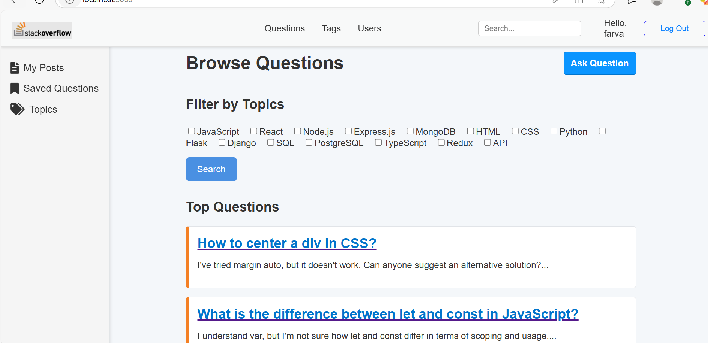
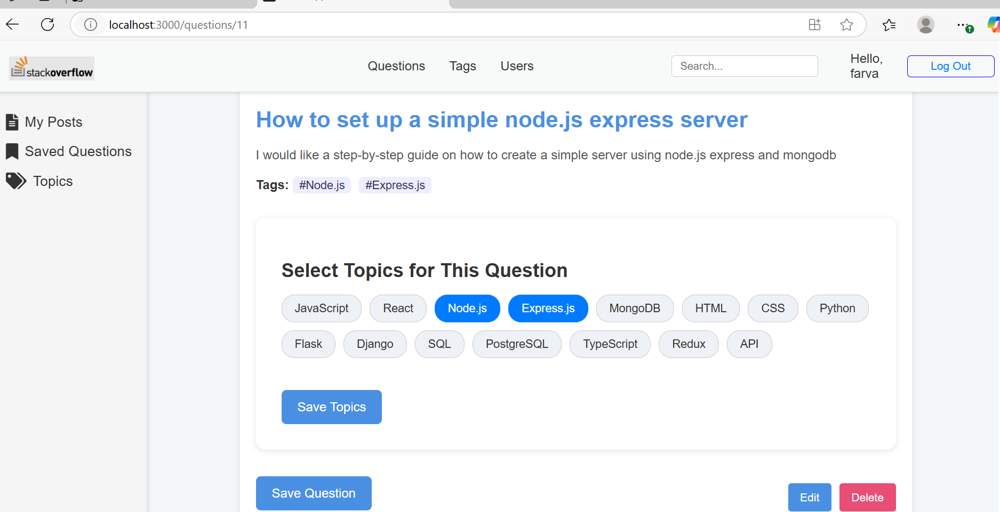
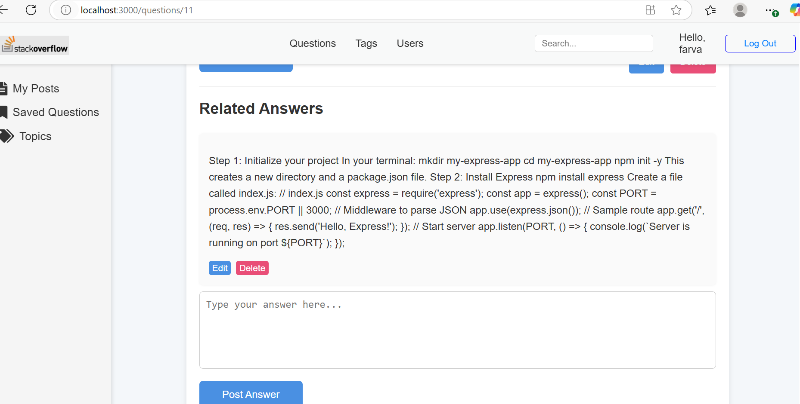

## Q&A Platform (Stackoverflow) fullstack application

## Frontend
This is the frontend for the Q&A platform built with React. It provides a user interface for browsing and posting questions, managing answers, comments, and topics.

## Tech Stack

- **React** – Component-based frontend UI
- **React Router** – Client-side routing
- **JWT Authentication** – Secure login/logout using JSON Web Tokens
- **CSS** – Basic styling and layout
- **LocalStorage** – Persistence for JWT tokens and user sessions

## Project Structure

src/
├── components/ # Reusable UI components (Navbar, Forms, Cards, etc.)
├── pages/ # Route-level pages (Home, Login, Signup, QuestionDetails, etc.)
├── utils/ # Helper functions (e.g., API handlers, auth)
├── App.js # Root component and route definitions
├── App.css # Global styles
└── index.js # Application entry point


## Features

- User **registration**, **login**, and **authentication** (with JWT)
- Post, edit, and delete **questions**
- Add, update, and delete **comments**
- **Save/unsave** questions for future reference
- **Tag** questions using dynamic **topics**
- **Filter** questions by topic (tag)
- Conditional rendering based on login/auth state
- Client-side navigation with route protection
- Seamless integration with a RESTful Flask backend
- Persist JWT authentication


## Setup Instructions

1. **Clone the repository**

```bash
git clone https://github.com/farvastra/stackoverflow-clone.git
```
## Install dependencies
npm install

## Configure environment
REACT_APP_API_URL=http://localhost:5000/api

## Start the development server
npm start

## Screenshots

**Homepage Screenshot**  

**detailspage screenshot** 

**detailspage screenshot** 


## API Integration
All API requests are made to the backend server using javascript fetch. 
JWT tokens are stored in localStorage for persistent authentication.
Headers are automatically attached to secure routes for authenticated users.


## Backend

This is the backend for the Q&A platform built with Flask. It supports user authentication, questions and answers posting, commenting, topic/tag management, and more.

## Tech Stack

- Python
- Flask
- Flask-JWT-Extended
- SQLAlchemy
- PostgreSQL (recommended for production)
- SQLite (used for local development and testing)
- Alembic (for database migrations)

## Project Structure

app/
├── init.py
├── models/
├── routes/
├── utils/
├── schemas/
├── config.py
migrations/

## Features

- User registration and login with JWT authentication
- CRUD for:
  - Questions
  - Answers
  - Comments
  - Topics (tags)
- Automatically assigns topics to questions based on title keywords
- Role-based user identity with protected routes

##  Setup Instructions

1. **Clone the repository**

```bash
git clone https://github.com/farvastra/stackoveflow-clone.git
```

##  Set up your virtual environment
python3 -m venv venv
source venv/bin/activate
pip install -r requirements.txt


## Set environment variables
SECRET_KEY=secret
DATABASE_URL=sqlite:///dev.db
SCHEMA=stack_overflow

## Run database migrations
flask db upgrade


## Seed the database
python seed.py

## Run the development server
flask run

**API Endpoints**

Some key routes:

POST api/auth/register - Register user

POST api/auth/login - Login and get JWT

POST api/questions/add - Create a question (auth required)

GET api/questions/ - List all questions

GET api/topics/all-topics - List all available topics


