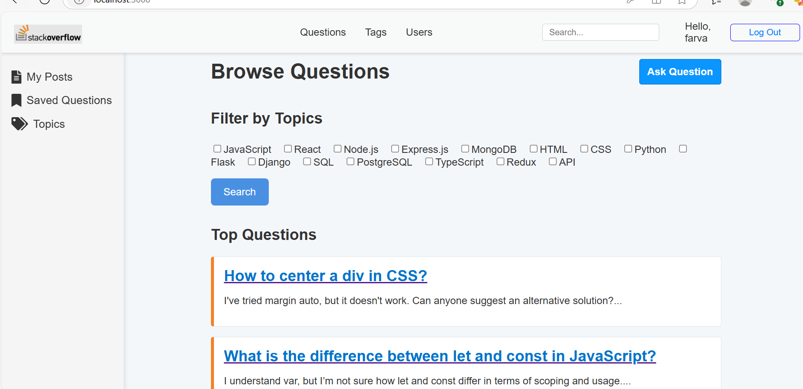
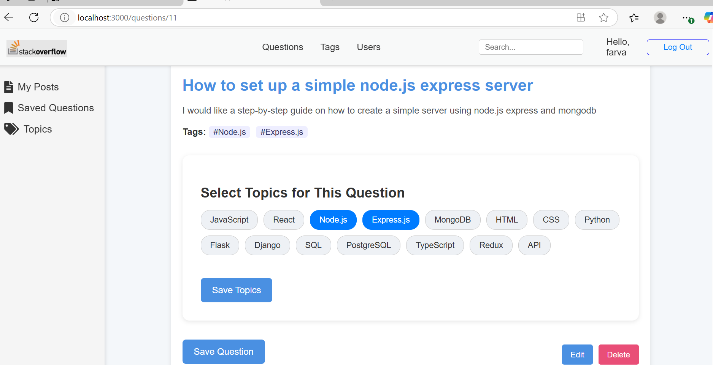
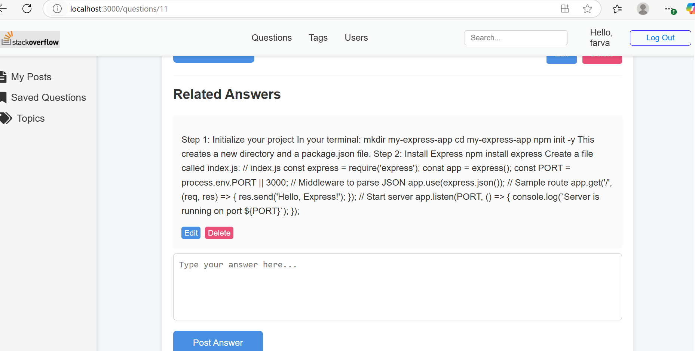

## Q&A Platform (Stackoverflow)  ## Frontend
This is the frontend for the Q&A platform built with React. It provides a user interface for browsing and posting questions, managing answers, comments, and topics.

## ⚙️ Tech Stack

- **React** – Component-based frontend UI
- **React Router** – Client-side routing
- **JWT Authentication** – Secure login/logout using JSON Web Tokens
- **CSS** – Basic styling and layout
- **LocalStorage** – Persistence for JWT tokens and user sessions

## Project Structure

src/
├── components/ # Reusable UI components (Navbar, Forms, Cards, etc.)
├── pages/ # Route-level pages (Home, Login, Signup, QuestionDetails, etc.)
├── utils/ # Helper functions (e.g., API handlers, auth.)
├── App.js # Root component and route definitions.
├── App.css # Global styles.
└── index.js # Application entry point.


## Features

- User **registration**, **login**, and **authentication** (with JWT)
- Post, edit, and delete **questions**
- Add, update, and delete **comments**
- **Save/unsave** questions for future reference
- **Tag** questions using dynamic **topics**
- **Filter** questions by topic (tag)
- Conditional rendering based on login/auth state
- Client-side navigation with route protection
- Seamless integration with a RESTful Flask backend
- Persist JWT authentication


## 🛠️ Setup Instructions

1. **Clone the repository**

```bash
git clone https://github.com/farvastra/stackoveflow-clone.git
```
## Install dependencies
npm install

## Configure environment
REACT_APP_API_URL=http://localhost:5000/api

## Start the development server
npm start

## Screenshots

**Homepage Screenshot**  

**detailspage screenshot** 

**detailspage screenshot** 


## API Integration
All API requests are made to the backend server using javascript fetch. 
JWT tokens are stored in localStorage for persistent authentication.
Headers are automatically attached to secure routes for authenticated users.

